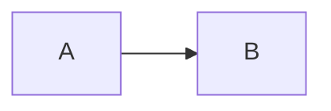

# AGENTS.md

## Project Overview

This is a greenfield `pnpm` + Vite + React + TypeScript app for presenting portrait-oriented demo slides from local MDX files in the browser.

The product goal is a presenter-first slide runtime:
- Slides are authored as MDX under `lectures/<lecture-slug>/<NNN-topic-name>.mdx`.
- Each slide declares frontmatter with a required `title` and optional `subtitle`.
- The browser renders exactly one fullscreen slide at `100vw` by `100dvh`.
- There are no visible controls, toolbars, gutters, progress bars, or buttons.
- `ArrowRight` advances, `ArrowLeft` rewinds, and bounds are no-ops.
- Lecture routes use `/lectures/:lectureSlug/:slideNumber`.

## Important Files

- `src/content/lectures.ts` builds and validates the lecture registry with `import.meta.glob`.
- `src/routes.tsx` parses and resolves lecture URLs.
- `src/presentation/Deck.tsx` owns keyboard navigation, URL synchronization, and slide selection.
- `src/presentation/SlideFrame.tsx` renders the consistent title/subtitle frame.
- `src/mdx/MdxProvider.tsx` exposes shared MDX components such as `Callout`, `Metric`, and Mermaid handling.
- `src/mdx/MermaidBlock.tsx` renders Mermaid diagrams.
- `src/styles.css` owns the fullscreen slide surface and must preserve the no-scroll, no-controls requirement.
- `lectures/demo-lecture/` is the example deck and should demonstrate every supported content capability.
- `tests/deck.spec.ts` verifies the app in a real browser with Playwright.

## Slide Authoring Contract

Slide files must be named with a contiguous 3-digit prefix:

```text
lectures/demo-lecture/001-title-and-subtitle.mdx
lectures/demo-lecture/002-markdown-and-gfm.mdx
```

Frontmatter:

```mdx
---
title: Slide Title
subtitle: Optional subtitle
---
```

Rules enforced by tests/build-time validation:
- `title` must be a non-empty string.
- `subtitle`, when present, must be a string.
- Slide numbers must be unique and contiguous within each lecture.
- Invalid filenames or paths should fail loudly.
- Empty lecture registries are invalid.

Lecture-local assets should live in `lectures/<lecture-slug>/assets/` and be referenced from MDX with relative paths.

Mermaid diagrams use fenced blocks:

````md

````

## Design And UX Constraints

Preserve the deck as the first and only visible experience. Do not add a landing page, lecture picker, visible navigation, progress indicator, toolbar, or presenter controls unless explicitly requested.

The slide surface must remain:
- exactly viewport-sized,
- non-scrollable,
- keyboard navigable,
- readable on both desktop and mobile viewports,
- visually quiet and presentation-grade.

When editing CSS, check that dynamic content, code blocks, images, and Mermaid SVGs do not create document overflow. The Playwright test includes overflow checks; keep those checks meaningful.

## Development Commands

Use `pnpm`.

```bash
pnpm install
pnpm dev
pnpm test:run
pnpm build
pnpm test:browser
```

`pnpm build` may warn about large chunks because Mermaid brings a large diagram bundle. A successful build with that warning is currently acceptable.

## Testing Expectations

When adding a feature or changing existing behavior, add new tests or update existing tests as needed in the same change. Do not leave test coverage stale when routes, validation, rendering, keyboard behavior, MDX capabilities, or fullscreen layout expectations change.

Do not run tests automatically after every change. Execute test commands only when explicitly requested by the user.

When the user asks to run the standard verification for app behavior changes, run:

```bash
pnpm test:run
pnpm build
```

When the user asks to run browser verification for UI, routing, keyboard navigation, Mermaid, or fullscreen layout changes, also run:

```bash
pnpm test:browser
```

If Playwright reports a missing browser binary, install Chromium with:

```bash
pnpm exec playwright install chromium
```

## Implementation Guidance

Keep the app small and explicit. Prefer focused modules over adding framework-style abstractions.

When changing lecture loading or validation:
- Update `src/content/lectures.test.ts`.
- Preserve eager build-time discovery unless there is a clear product reason to change it.

When changing routes or URL behavior:
- Update `src/routes.test.tsx`.
- Ensure root still redirects/replaces to `/lectures/demo-lecture/1`.

When changing navigation or rendering:
- Update `src/presentation/Deck.test.tsx`.
- Preserve URL replacement on arrow navigation.
- Keep left/right bounds as no-ops.

When changing slide capabilities:
- Add or update a demo slide in `lectures/demo-lecture/`.
- Add regression coverage when the capability affects parsing, rendering, or browser behavior.

Avoid unrelated refactors. This project is intentionally simple: MDX in, fullscreen slide out.
