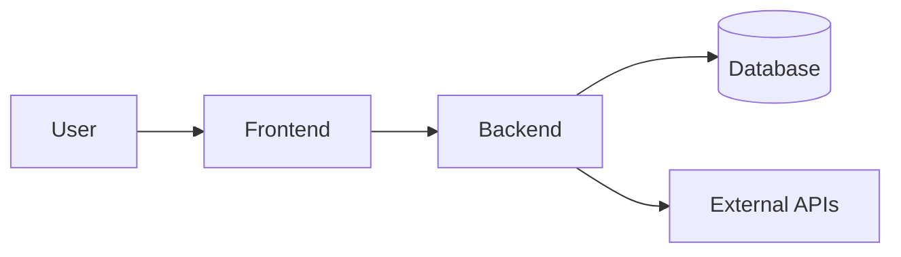

## Система - це набір відповідальностей

<Callout variant="principle" title="Decomposition">
  Ділимо систему так, щоб кожна частина мала одну причину змінюватися: UI показує, backend вирішує правила, база зберігає стан.
</Callout>

