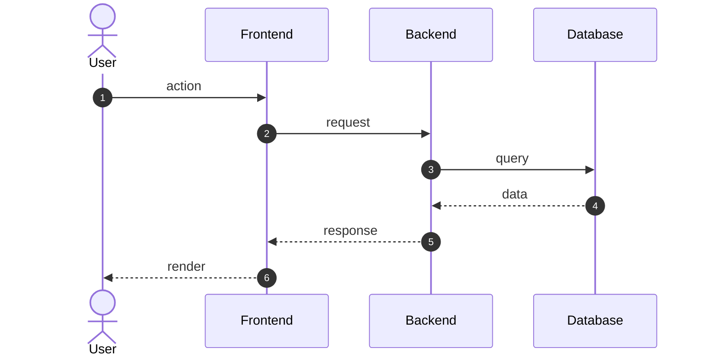

### як працює типова web-app система?

```mermaid
sequenceDiagram
  autonumber
  actor User
  participant Frontend
  participant Backend
  participant Database

  User->>Frontend: action
  Frontend->>Backend: request
  Backend->>Database: query
  Database-->>Backend: data
  Backend-->>Frontend: response
  Frontend-->>User: render
```
