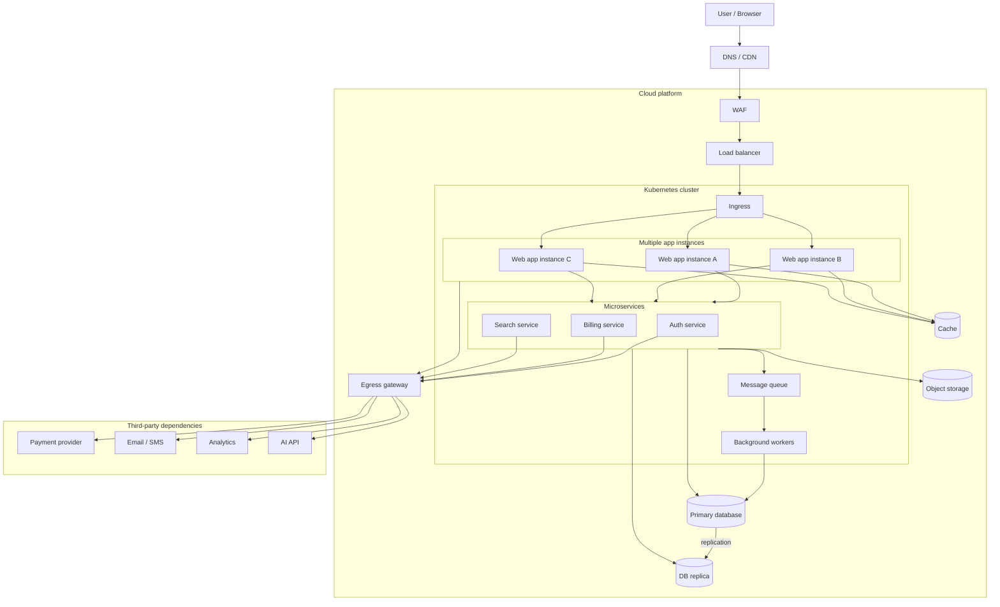

### корпоративне production рішення

```mermaid
flowchart TB
  User[User / Browser]
  DNS[DNS / CDN]

  subgraph Cloud[Cloud platform]
    WAF[WAF]
    LB[Load balancer]
    Egress[Egress gateway]

    subgraph K8s[Kubernetes cluster]
      Ingress[Ingress]

      subgraph Apps[Multiple app instances]
        App1[Web app instance A]
        App2[Web app instance B]
        App3[Web app instance C]
      end

      subgraph Services[Microservices]
        Auth[Auth service]
        Billing[Billing service]
        Search[Search service]
      end

      Queue[Message queue]
      Workers[Background workers]
    end

    Cache[(Cache)]
    DB[(Primary database)]
    Replica[(DB replica)]
    ObjectStore[(Object storage)]
  end

  subgraph External[Third-party dependencies]
    Payments[Payment provider]
    Email[Email / SMS]
    Analytics[Analytics]
    AI[AI API]
  end

  User --> DNS --> WAF --> LB --> Ingress
  Ingress --> App1
  Ingress --> App2
  Ingress --> App3

  App1 --> Cache
  App2 --> Cache
  App3 --> Cache

  App1 --> Services
  App2 --> Services
  App3 --> Services

  Services --> DB
  Services --> Replica
  DB -->|replication| Replica
  Services --> ObjectStore
  Services --> Queue
  Queue --> Workers
  Workers --> DB

  Auth --> Egress
  Billing --> Egress
  Search --> Egress
  Apps --> Egress
  Egress --> Email
  Egress --> Payments
  Egress --> Analytics
  Egress --> AI
```
