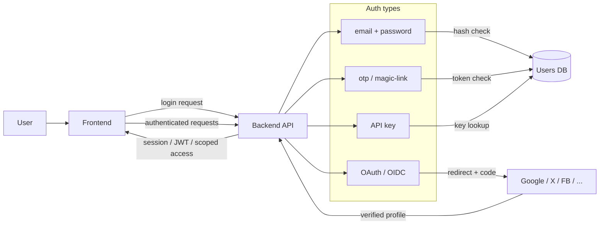

### auth

|  |  |
| --- | --- |
| логіниться юзер, потрібно швидко | email + password |
| логіниться юзер, потрібно зручно | OAuth / OIDC |
| не хочемо зберігати паролі | magic link / OTP |
| інший сервіс викликає наш backend | API key або client credentials |
