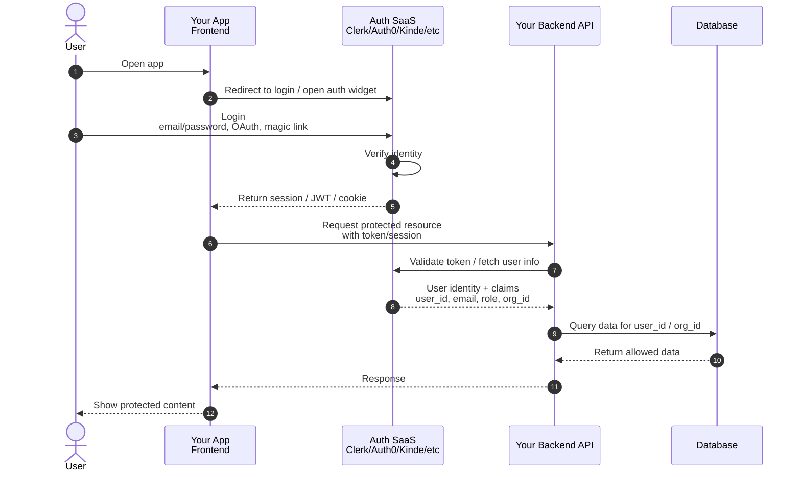

### > auth / saas in depth

```mermaid
sequenceDiagram
    autonumber

    actor User as User
    participant App as Your App<br/>Frontend
    participant Auth as Auth SaaS<br/>Clerk/Auth0/Kinde/etc
    participant API as Your Backend API
    participant DB as Database

    User->>App: Open app
    App->>Auth: Redirect to login / open auth widget

    User->>Auth: Login<br/>email/password, OAuth, magic link
    Auth->>Auth: Verify identity

    Auth-->>App: Return session / JWT / cookie

    App->>API: Request protected resource<br/>with token/session
    API->>Auth: Validate token / fetch user info
    Auth-->>API: User identity + claims<br/>user_id, email, role, org_id

    API->>DB: Query data for user_id / org_id
    DB-->>API: Return allowed data

    API-->>App: Response
    App-->>User: Show protected content
```