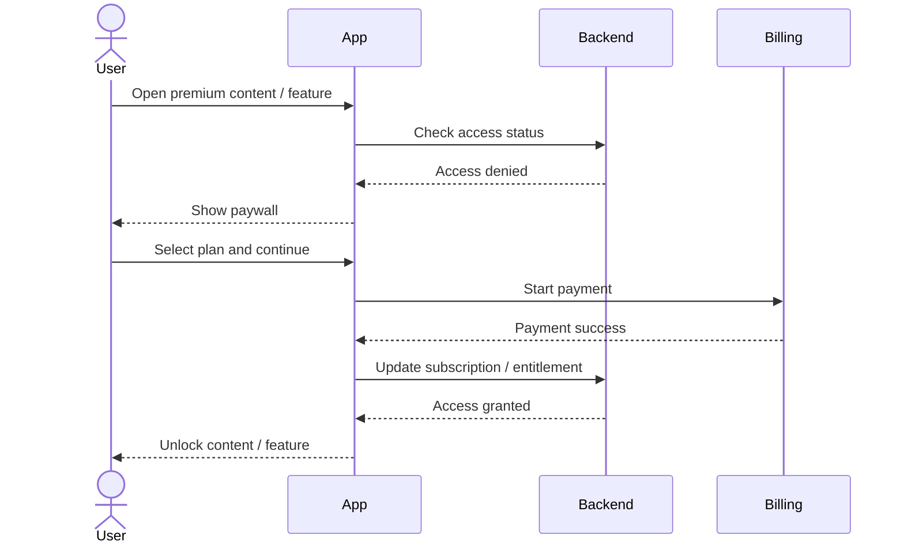

import paywall from "./assets/paywall.png";

### > paywall

### Global: [Stripe](https://stripe.com/), [LemonSqueezy](https://www.lemonsqueezy.com/), [Paddle](https://www.paddle.com/) 
### Ukraine: [LiqPay](https://www.liqpay.ua), [WayForPay](https://wayforpay.com)
### Crypto: [NOWPayments](https://nowpayments.io/), [CoinGate](https://coingate.com/), [Coinbase Business](https://www.coinbase.com/business), [Self Hosted BTCPayServer](https://btcpayserver.org/)