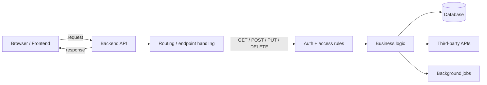

## > backend / base

### lang: <strong>NodeJS</strong>
### framework: <strong>[ExpressJS](https://expressjs.com/)/[NestJS](https://nestjs.com/)</strong>

NodeJS/ExpressJS/NestJS --> дуже сильне та розвинути комʼюніті

frontend + backend на JS --> менше тертя, схожий принцип роботи коду
