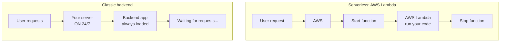

## > backend без backend

|  |  |
| --- | --- |
| classic backend | один сервер увімкнений постійно, навіть коли запитів нема (pay-for-time) |
| serverless | запускається процес під запит і потім тушиться (pay-for-call) |

serverless добре підходить для маленьких API, webhooks, integrations і задач, які запускаються не постійно (Stripe webhook, contact form email, image resize).

### Serverless Saas: [AWS Lambda](https://aws.amazon.com/lambda/), [Supabase Edge Functions](https://supabase.com/docs/guides/functions), [Firebase Cloud Functions](https://firebase.google.com/products/functions), [Vercel Functions](https://vercel.com/docs/functions)
