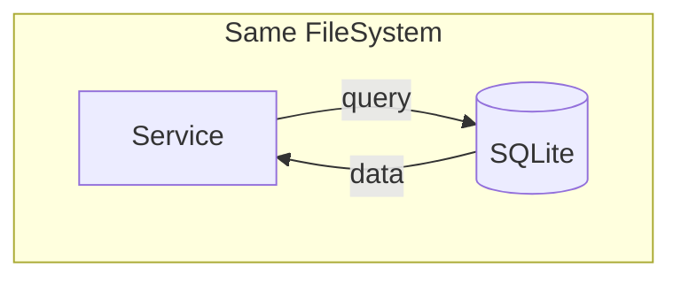

## > database / не ускладнюй

### → [sqlite](https://sqlite.org/) ←

<Callout variant="principle" title="Правило вибору">
    - один процес / один юзер / локально → SQLite

    - нетворк / параллельний запис / масштаб / висока доступність → PostgreSQL / MySQL

    - втрата даних критична → іди в SaaS
</Callout>
