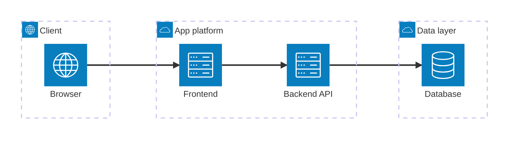

### fe + be + db

```mermaid
architecture-beta
  group client(internet)[Client]
  group app(cloud)[App platform]
  group data(cloud)[Data layer]

  service browser(internet)[Browser] in client
  service frontend(server)[Frontend] in app
  service backend(server)[Backend API] in app
  service database(database)[Database] in data

  browser:R --> L:frontend
  frontend:R --> L:backend
  backend:R --> L:database
```

### use cases:
- e2e expirience
- e-commerce: каталог, кошик, замовлення, адмінка
- booking: календар, бронювання, оплати, історія змін
