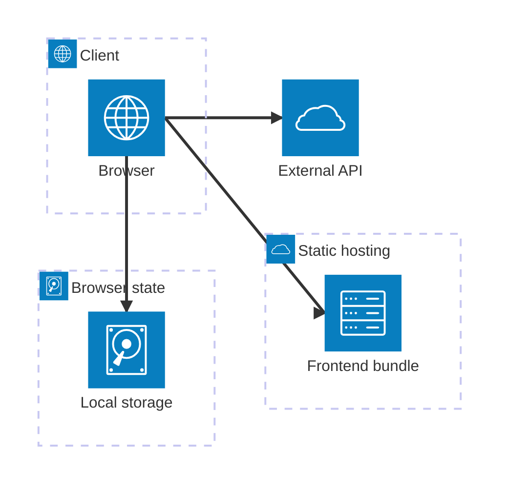

### fe

```mermaid
architecture-beta
  group client(internet)[Client]
  group static_host(cloud)[Static hosting]
  group browser_state(disk)[Browser state]

  service browser(internet)[Browser] in client
  service frontend(server)[Frontend bundle] in static_host
  service local_storage(disk)[Local storage] in browser_state
  service external_api(cloud)[External API]

  browser:R --> L:frontend
  browser:B --> T:local_storage
  browser:R --> L:external_api
```

### use cases:
- landing page або portfolio на статичному хостингу
- docs / blog / changelog без власного backend
