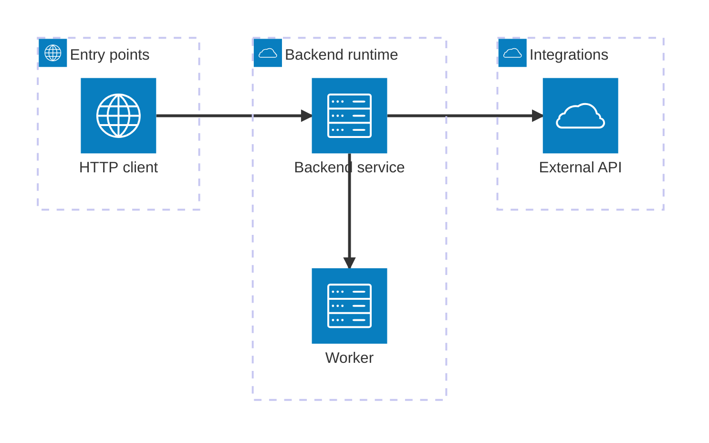

### be

```mermaid
architecture-beta
  group entry(internet)[Entry points]
  group runtime(cloud)[Backend runtime]
  group integrations(cloud)[Integrations]

  service http(internet)[HTTP client] in entry
  service backend(server)[Backend service] in runtime
  service worker(server)[Worker] in runtime
  service external_api(cloud)[External API] in integrations

  http:R --> L:backend
  backend:B --> T:worker
  backend:R --> L:external_api
```

### use cases:
- webhook receiver для Stripe, GitHub або Telegram
- public API для mobile app, CLI або партнерської інтеграції
- worker service: resize images, send emails
