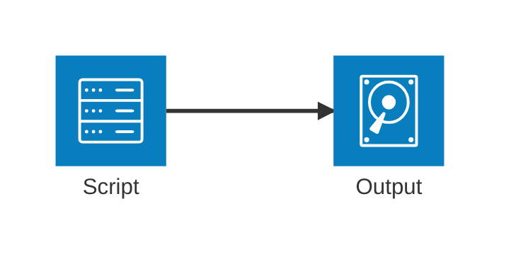

### just a script

```mermaid
architecture-beta
  service script(server)[Script]
  service output(disk)[Output]

  script:R --> L:output
```

### use cases:
- нормалізація/генерування документу перед відправкою
- one-off import або migration з файлу в базу
