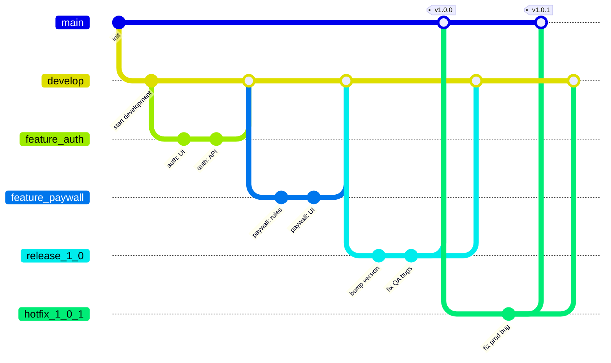

### `clone` | `init` | `add` | `commit` | `pull` | `push` | `branch` | `merge/rebase`

```mermaid
gitGraph
  commit id: "init"

  branch develop
  checkout develop
  commit id: "start development"

  branch feature_auth
  checkout feature_auth
  commit id: "auth: UI"
  commit id: "auth: API"

  checkout develop
  merge feature_auth

  branch feature_paywall
  checkout feature_paywall
  commit id: "paywall: rules"
  commit id: "paywall: UI"

  checkout develop
  merge feature_paywall

  branch release_1_0
  checkout release_1_0
  commit id: "bump version"
  commit id: "fix QA bugs"

  checkout main
  merge release_1_0 tag: "v1.0.0"

  checkout develop
  merge release_1_0

  checkout main
  branch hotfix_1_0_1
  checkout hotfix_1_0_1
  commit id: "fix prod bug"

  checkout main
  merge hotfix_1_0_1 tag: "v1.0.1"

  checkout develop
  merge hotfix_1_0_1
```