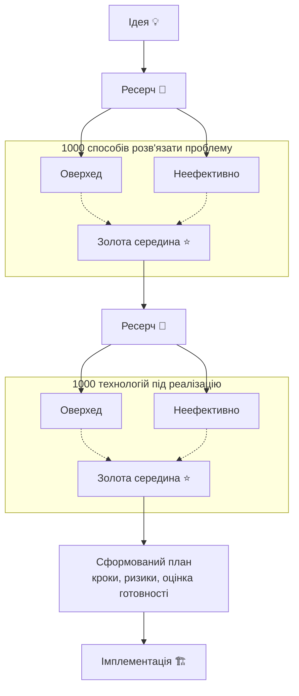

```mermaid
flowchart TB
  idea["Ідея 💡"]
  research["Ресерч 🧪"]

  idea --> research

  subgraph solutionMap["1000 способів розв'язати проблему"]
    direction LR
    solutionEffective["Оверхед"]
    solutionBalanced["Золота середина ⭐️"]
    solutionIneffective["Неефективно"]
  end

  research --> solutionEffective
  research --> solutionIneffective
  solutionEffective -.-> solutionBalanced
  solutionIneffective -.-> solutionBalanced

  selectedSolution["Ресерч 🧪"]
  solutionBalanced --> selectedSolution

  subgraph toolMap["1000 технологій під реалізацію"]
    direction LR
    toolEffective["Оверхед"]
    toolBalanced["Золота середина ⭐️"]
    toolIneffective["Неефективно"]
  end

  selectedSolution --> toolEffective
  selectedSolution --> toolIneffective
  toolEffective -.-> toolBalanced
  toolIneffective -.-> toolBalanced

  plan["Сформований план<br/>кроки, ризики, оцінка готовності"]
  done["Імплементація 🏗️"]

  toolBalanced --> plan --> done

  class solutionBalanced,toolBalanced decisionChosen
  class solutionEffective,solutionIneffective,toolEffective,toolIneffective decisionMuted
  class plan,done decisionFinal
```

### Оверхед → рішення занадто складне/важке для задачі.
### Неефективність → рішення занадто слабке/криве для задачі.