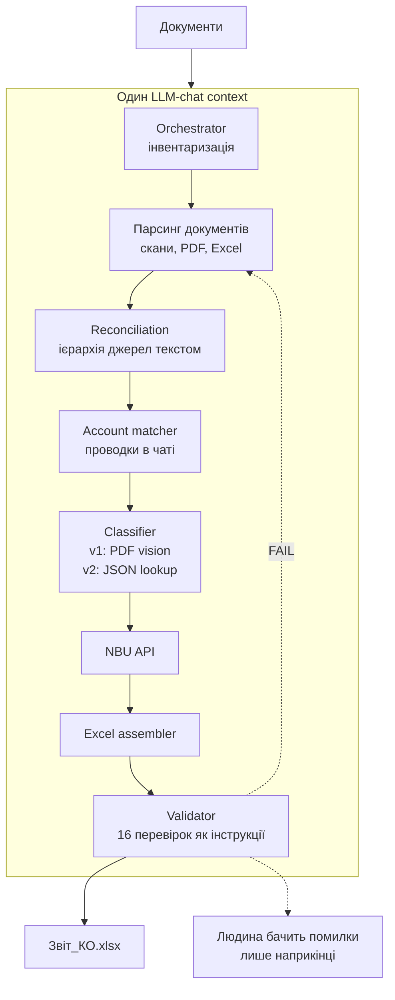

## tax report automation / current solution

### Claude skill, одна сесія

```mermaid
flowchart TB
  docs["Документи"]

  subgraph chat["Один LLM-chat context"]
    direction TB

    inv["Orchestrator<br/>інвентаризація"]
    parse["Парсинг документів<br/>скани, PDF, Excel"]
    reconcile["Reconciliation<br/>ієрархія джерел текстом"]
    account["Account matcher<br/>проводки в чаті"]
    classify["Classifier<br/>v1: PDF vision<br/>v2: JSON lookup"]
    rate["NBU API"]
    excel["Excel assembler"]
    validate["Validator<br/>16 перевірок як інструкції"]

    inv --> parse --> reconcile --> account --> classify --> rate --> excel --> validate
    validate -. "FAIL" .-> parse
  end

  output["Звіт_КО.xlsx"]

  docs --> chat
  validate --> output

  lateReview["Людина бачить помилки<br/>лише наприкінці"]

  validate -.-> lateReview

  class chat,parse,account,validate decisionMuted
  class classify decisionChosen
  class output decisionFinal
```
