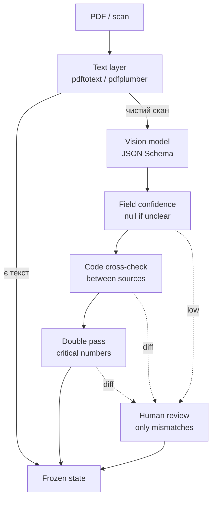

## tax report automation / better solution

LLM не приймає фінальні факти. Вона лише витягує дані з документів і пояснює невпевнені місця. Якість дають frozen state, source links, детерміновані lookup-таблиці, формули, API НБУ та fail-fast валідація.

### не просимо модель “прочитати документ”

Один документ до віжн vision-моделі, через саб агента, structured output, confidence на кожне поле. 
Далі точність дає не модель, а cross-check кодом і review тільки там,
де не зійшлося.
