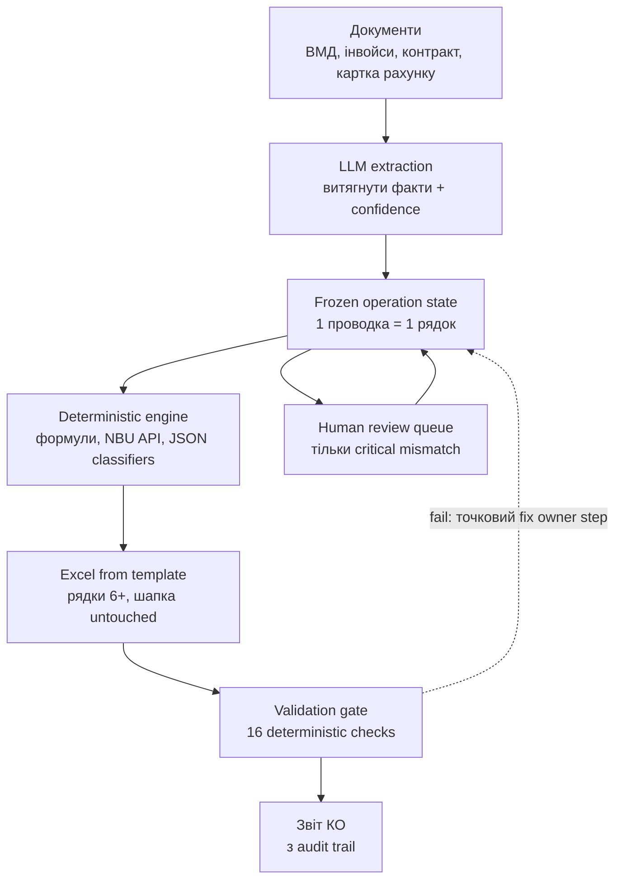

## tax report automation / better solution

<Callout variant="principle" title="quality move">
  ### не “15 агентів у чаті”, а pipeline з доказами

  LLM не приймає фінальні факти. Вона лише витягує дані з документів і пояснює
  невпевнені місця. Якість дають frozen state, source links, детерміновані
  lookup-таблиці, формули, API НБУ та fail-fast валідація.
</Callout>
