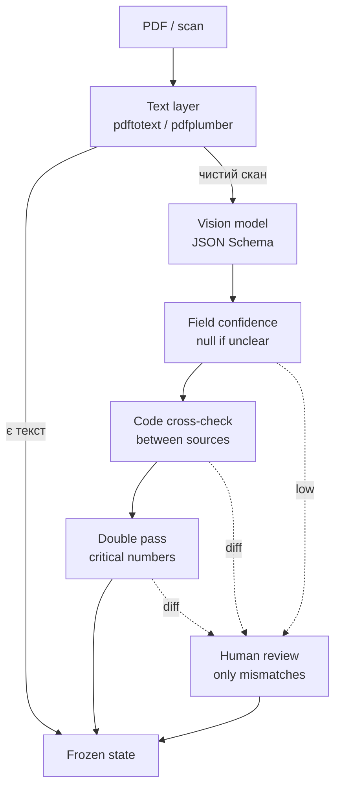

## tax report automation / extraction quality

<Callout variant="principle" title="practical rule">
  ### не просимо модель “прочитати документ”

  Спочатку забираємо текстовий шар кодом. Якщо це справді скан — один документ
  за виклик vision-моделі, structured output, confidence на кожне поле, заборона
  вгадувати. Далі точність дає не модель, а cross-check кодом і review тільки там,
  де не зійшлося.
</Callout>
