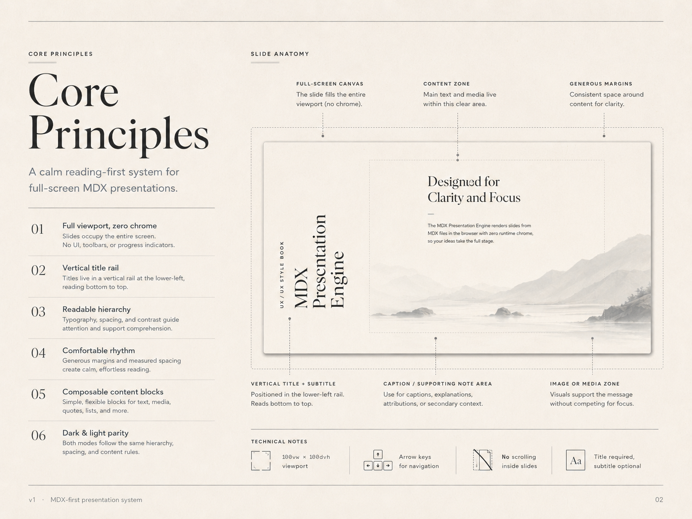

# 02 — Slide Anatomy

## Visual reference



## Base canvas

Every slide is a full-screen canvas.

```css
.slide {
  width: 100vw;
  height: 100dvh;
  overflow: hidden;
  position: relative;
}
```

There is no internal page scroll.

If content does not fit, the author must split it into multiple slides.

## Primary regions

A slide has five conceptual regions:

1. canvas
2. vertical title rail
3. content zone
4. media zone
5. caption / supporting note zone

```text
┌──────────────────────────────────────────────┐
│                                              │
│   ┌──── title rail ────┐  content zone       │
│   │                    │                     │
│   │                    │  heading/body/code  │
│   │                    │                     │
│   │                    │       media zone    │
│   │                    │                     │
│   └────────────────────┘  caption / note     │
│                                              │
└──────────────────────────────────────────────┘
```

## Vertical title rail

The title rail is positioned in the lower-left corner.

Recommended behavior:

```css
.slide-title-rail {
  position: absolute;
  left: var(--space-8);
  bottom: var(--space-8);
  width: var(--title-rail-width);
  transform-origin: left bottom;
  writing-mode: vertical-rl;
  text-orientation: mixed;
}
```

Recommended content:

```tsx
<aside className="slide-title-rail">
  {subtitle && <span className="slide-subtitle">{subtitle}</span>}
  <h1 className="slide-title">{title}</h1>
</aside>
```

Rules:

- title is required
- subtitle is optional
- title/subtitle render on every slide
- rail reads bottom-to-top
- rail never becomes a navigation element
- rail should feel like a spine, not a sidebar

## Content zone

The content zone holds the main idea.

Recommended content max width:

```css
--content-max-width: 680px;
--content-wide-max-width: 760px;
```

Rules:

- one dominant idea per slide
- do not fill every area
- line length should stay readable
- left alignment is preferred
- centered composition is allowed for quotes or section breaks

## Media zone

Media can support the message, but should not compete with the message.

Preferred positions:

- right side
- lower-right
- full-width background only when low contrast and calm

Rules:

- images should be desaturated or low-saturation
- avoid high-detail backgrounds behind body text
- add captions when context matters
- media should support comprehension, not decorate randomly

## Caption / supporting note zone

Captions are for context.

Use captions for:

- image source/context
- diagram explanation
- code note
- attribution
- secondary clarification

Captions should stay smaller, quieter, and visually separate from the main idea.

## No visible controls

The slide must not render:

- arrows
- buttons
- progress bar
- slide number
- lecture picker
- toolbar

Keyboard navigation is enough.

## Technical notes

- viewport: `100vw × 100dvh`
- next slide: `ArrowRight`
- previous slide: `ArrowLeft`
- at deck bounds: no-op
- URL updates with active slide
- no scrolling inside slides
