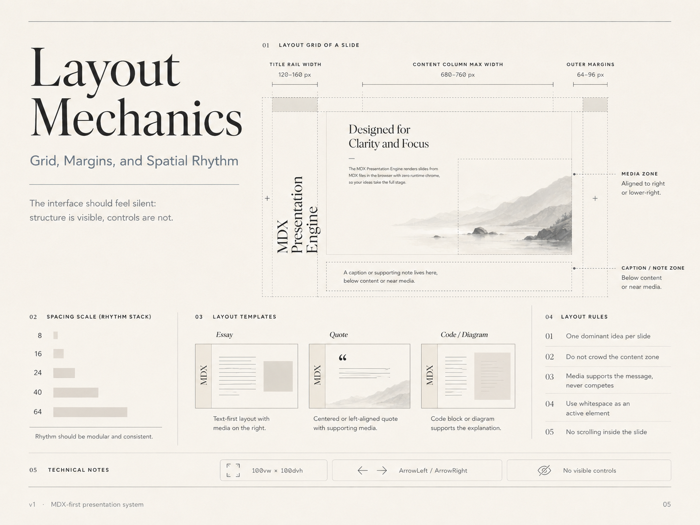

# 05 — Layout Mechanics

## Visual reference



## Direction

The interface should feel silent: structure is visible, controls are not.

Layout should be architectural, calm, and predictable.

## Slide grid

Recommended base values:

| Token | Value | Use |
|---|---:|---|
| `--outer-margin` | 64–96px | Main canvas margin |
| `--title-rail-width` | 120–160px | Vertical title rail |
| `--content-max-width` | 680px | Default content column |
| `--content-wide-max-width` | 760px | Wide content / diagrams |
| `--media-max-width` | 40–55vw | Large image or diagram area |

## Layout zones

```text
[outer margin]
  [title rail] [content zone] [media zone]
[outer margin]
```

The title rail is persistent.

The content zone changes depending on the slide pattern.

The media zone is optional.

## Spacing scale

Use a simple modular rhythm:

| Token | Value |
|---|---:|
| `--space-1` | 8px |
| `--space-2` | 16px |
| `--space-3` | 24px |
| `--space-4` | 40px |
| `--space-5` | 64px |
| `--space-6` | 96px |

Rules:

- use spacing consistently
- do not invent random margins per component
- prefer fewer, larger gaps over many small gaps
- keep rhythm consistent between light and dark modes

## Default slide layout

```css
.slide {
  position: relative;
  width: 100vw;
  height: 100dvh;
  overflow: hidden;
  background: var(--color-bg);
  color: var(--color-text);
}

.slide-content {
  position: absolute;
  left: calc(var(--outer-margin) + var(--title-rail-width) + var(--space-5));
  top: var(--outer-margin);
  right: var(--outer-margin);
  bottom: var(--outer-margin);
  display: grid;
  align-content: center;
}
```

## Layout patterns

### Essay

Best for:

- introduction
- explanation
- conceptual argument
- narrative content

Composition:

- title rail at lower-left
- main heading left-aligned
- short paragraph stack
- optional calm media on right or lower-right

### Quote

Best for:

- section break
- key insight
- memorable statement
- attribution

Composition:

- title rail at lower-left
- quote centered or left-aligned
- attribution below
- optional low-contrast background image

### Code + Notes

Best for:

- implementation detail
- API shape
- algorithm
- configuration

Composition:

- title rail at lower-left
- code block as primary object
- short explanation below or beside
- language label required

### Diagram / Table

Best for:

- systems
- processes
- relationships
- comparisons
- structured information

Composition:

- title rail at lower-left
- diagram/table in content zone
- short caption or takeaway

## Density rules

A slide should contain:

- one dominant idea
- one primary visual/content object
- one short explanatory layer

Avoid combining:

- large table + long paragraph + image
- code block + diagram + bullet list
- two unrelated ideas
- more than one callout unless the slide is a component showcase

## No scrolling

If content does not fit, split it.

Bad:

```mdx
# One slide with 80 lines of explanation
```

Good:

```text
001-concept.mdx
002-example.mdx
003-implication.mdx
```
