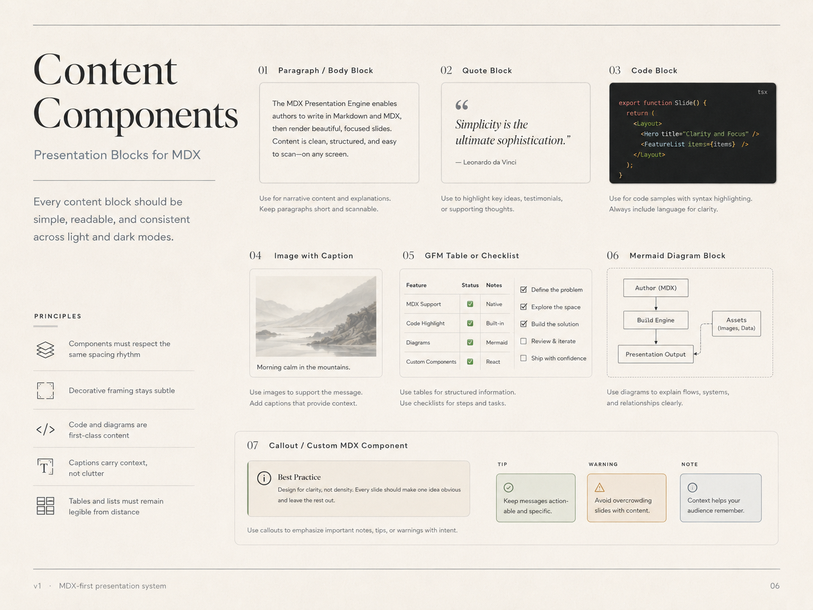
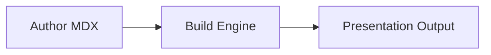

# 06 — Content Components

## Visual reference



## Direction

Every content block should be simple, readable, and consistent across light and dark modes.

MDX gives authors freedom, but the visual system should keep that freedom disciplined.

## Component rules

### Paragraph / body block

Use for narrative explanation.

Rules:

- keep paragraphs short
- avoid more than 4–6 lines per paragraph
- max width around `58ch`
- use body text, not display type

```mdx
The engine renders MDX files as focused, full-screen slides.
Each slide should make one idea obvious.
```

### Headings

Use headings to create hierarchy, not decoration.

Rules:

- one main heading per slide
- avoid deep heading nesting
- H1/H2 are enough for most slides

```mdx
## Designing for clarity
```

### Lists

Use lists for scanning.

Rules:

- keep list items short
- use 3–5 bullets where possible
- avoid nested lists unless necessary

```mdx
- Full viewport
- Zero visible controls
- Consistent title rail
```

### Quote block

Use for key ideas, testimonials, references, or philosophical statements.

Rules:

- one quote per slide
- use attribution when known
- keep quote short enough to breathe

```mdx
> Simplicity is the ultimate sophistication.
>
> — Leonardo da Vinci
```

### Code block

Use for technical content.

Rules:

- always include language
- use syntax highlighting
- keep line length readable
- avoid huge code dumps
- explain why the snippet matters

````mdx
```tsx
export type SlideFrontmatter = {
  title: string;
  subtitle?: string;
};
```
````

### Image with caption

Use images to support the message.

Rules:

- prefer calm, desaturated images
- avoid busy backgrounds behind text
- always add caption when context matters

```mdx
<Figure src="./assets/mountains.jpg" caption="A calm visual should support, not dominate." />
```

### GFM table

Use tables for compact structured comparison.

Rules:

- keep column count small
- avoid tiny text
- prefer 2–4 columns
- avoid wide dense tables

```mdx
| Feature | Status | Notes |
|---|---:|---|
| MDX | ✅ | Native content format |
| Mermaid | ✅ | Diagrams from fenced code |
```

### Checklist

Use checklists for process status or authoring tasks.

```mdx
- [x] Define the idea
- [x] Add supporting visual
- [ ] Split dense content
```

### Mermaid diagram

Use diagrams for systems, flows, and relationships.

Rules:

- keep diagrams simple
- use short labels
- avoid large flowcharts
- diagram must fit without scroll

````mdx

````

### Callout / custom MDX component

Use callouts for emphasis, not decoration.

Recommended variants:

- `tip`
- `note`
- `warning`
- `principle`

```mdx
<Callout variant="principle" title="Best Practice">
  Design for clarity, not density.
</Callout>
```

Rules:

- one callout per slide unless comparing variants
- title should be short
- body should be action-oriented
- visual treatment should stay subtle

## Component principle checklist

Every component should pass these checks:

- Does it respect the spacing rhythm?
- Is it readable from presentation distance?
- Does it work in light and dark modes?
- Does it support one dominant idea?
- Is decorative framing subtle?
- Does it avoid scroll?
