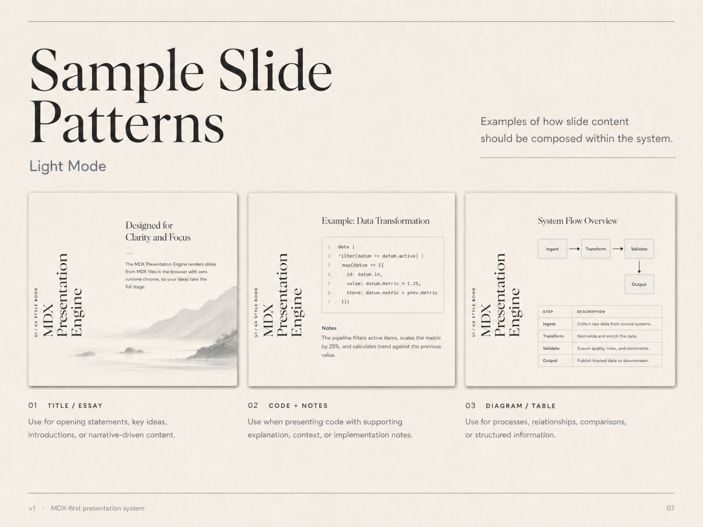
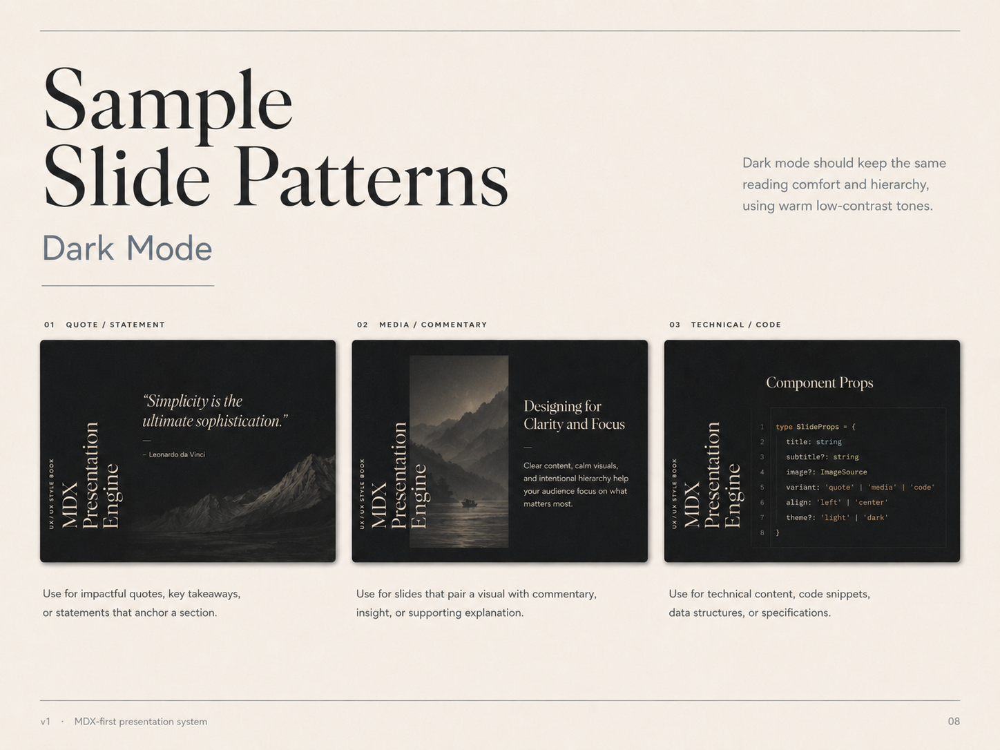
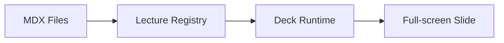

# 07 — Slide Patterns

## Visual references





## Direction

Patterns are recommended compositions for common content types.

They should help authors create consistent slides without manually designing every screen.

## Pattern 1 — Title / Essay

Use for:

- opening statements
- key ideas
- introductions
- narrative-driven content

Structure:

```text
vertical rail | heading
              | short paragraph
              | optional calm image
```

MDX example:

```mdx
---
title: Designing for Clarity
subtitle: UI / UX Style Book
---

# Designing for Clarity and Focus

The engine renders MDX files as calm, full-screen slides with no visible controls.
```

Rules:

- one strong heading
- one short explanatory paragraph
- optional calm media
- no bullet overload

## Pattern 2 — Quote / Statement

Use for:

- memorable takeaway
- section transition
- thesis statement
- quote with attribution

Structure:

```text
vertical rail | quote
              | attribution
              | optional quiet image/background
```

MDX example:

```mdx
---
title: Simplicity
subtitle: Principle
---

> Simplicity is the ultimate sophistication.
>
> — Leonardo da Vinci
```

Rules:

- quote should be the primary visual object
- attribution is small and quiet
- avoid adding unrelated explanation

## Pattern 3 — Code + Notes

Use for:

- API examples
- component props
- configuration
- algorithms

Structure:

```text
vertical rail | code block
              | short note / takeaway
```

MDX example:

````mdx
---
title: Slide Props
subtitle: Technical
---

```tsx
type SlideProps = {
  title: string;
  subtitle?: string;
  theme?: 'light' | 'dark';
};
```

The slide contract stays small: title is required, subtitle and theme are optional.
````

Rules:

- include language for highlighting
- avoid long files
- explain the purpose, not every line

## Pattern 4 — Diagram / Table

Use for:

- systems
- flows
- comparisons
- decision logic

Structure:

```text
vertical rail | diagram/table
              | caption / explanation
```

MDX example:

````mdx
---
title: Build Flow
subtitle: Mermaid
---



The registry converts files into a navigable lecture deck.
````

Rules:

- keep labels short
- fit the diagram inside the slide
- caption explains why the diagram matters

## Pattern 5 — Media / Commentary

Use for:

- visual concept
- product screenshot
- diagram with explanatory text
- aesthetic or mood slide

Structure:

```text
vertical rail | media zone
              | commentary block
```

Rules:

- media and commentary should not fight
- keep image calm and desaturated
- commentary should be short

## Pattern 6 — Component Showcase

Use for:

- demo lecture
- docs of supported MDX features
- comparison of variants

Structure:

```text
vertical rail | grid of components
              | short labels
```

Rules:

- only use dense grids in demo/documentation decks
- keep each specimen small and clearly labeled
- avoid this pattern for normal presentations
