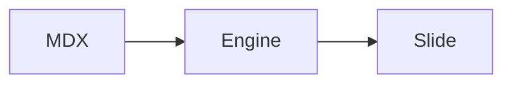

# 09 — MDX Authoring Guide

## Visual reference


## Authoring philosophy

Write slides like short editorial pages.

Each slide should answer one question:

> What should the viewer understand from this screen?

If the answer has multiple parts, split it into multiple slides.

## Basic slide structure

```mdx
---
title: Designing for Clarity
subtitle: UI / UX Style Book
---

# Designing for Clarity and Focus

The MDX Presentation Engine renders calm, full-screen slides from local MDX files.
```

## Required frontmatter

```yaml
title: string
subtitle?: string
```

The engine uses this metadata for the persistent vertical title rail.

Do not duplicate the slide title rail manually inside content.

## Writing rules

### Keep one dominant idea

Bad:

```mdx
# Engine Architecture, Color System, Keyboard Navigation, and MDX Components
```

Good:

```mdx
# Engine Architecture
```

Then split color, keyboard navigation, and components into separate slides.

### Prefer short paragraphs

Bad:

```mdx
A very long paragraph that explains everything on one slide and becomes visually dense...
```

Good:

```mdx
The engine keeps controls invisible.

Navigation happens through keyboard input and URL state.
```

### Use lists for scanning

```mdx
- Full viewport
- Zero visible controls
- Consistent title rail
- MDX-first content
```

### Use tables only when they simplify

```mdx
| Token | Light | Dark |
|---|---:|---:|
| Background | `#F7F4EF` | `#171613` |
| Text | `#1F1E1B` | `#E8E1D5` |
```

Avoid large tables that require tiny text.

### Use code blocks intentionally

````mdx
```tsx
type SlideFrontmatter = {
  title: string;
  subtitle?: string;
};
```
````

Add a short explanation after the code.

### Use Mermaid for simple flows

````mdx

````

Keep diagrams short.

## Suggested slide sequence for demo lecture

```text
001-title-and-subtitle.mdx
002-markdown-and-gfm.mdx
003-code-highlighting.mdx
004-assets-and-images.mdx
005-mdx-components.mdx
006-mermaid-diagram.mdx
```

## Author checklist

Before committing a slide, check:

- Does it have `title` frontmatter?
- Is the subtitle useful, or just noise?
- Is there one dominant idea?
- Does it fit without scroll?
- Is the text readable from distance?
- Does the slide work in both light and dark modes?
- Are code blocks labeled with a language?
- Are images calm and relevant?
- Are captions useful, not decorative?
