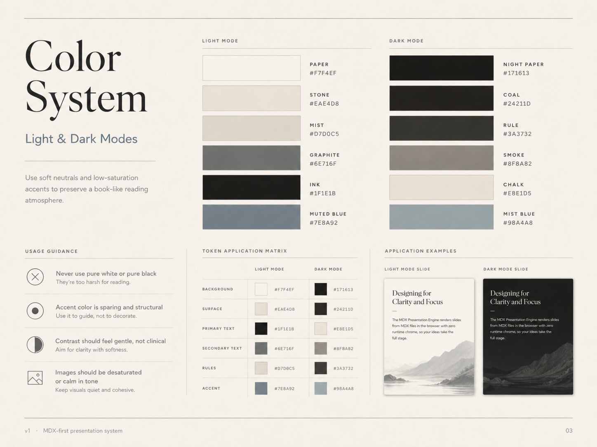
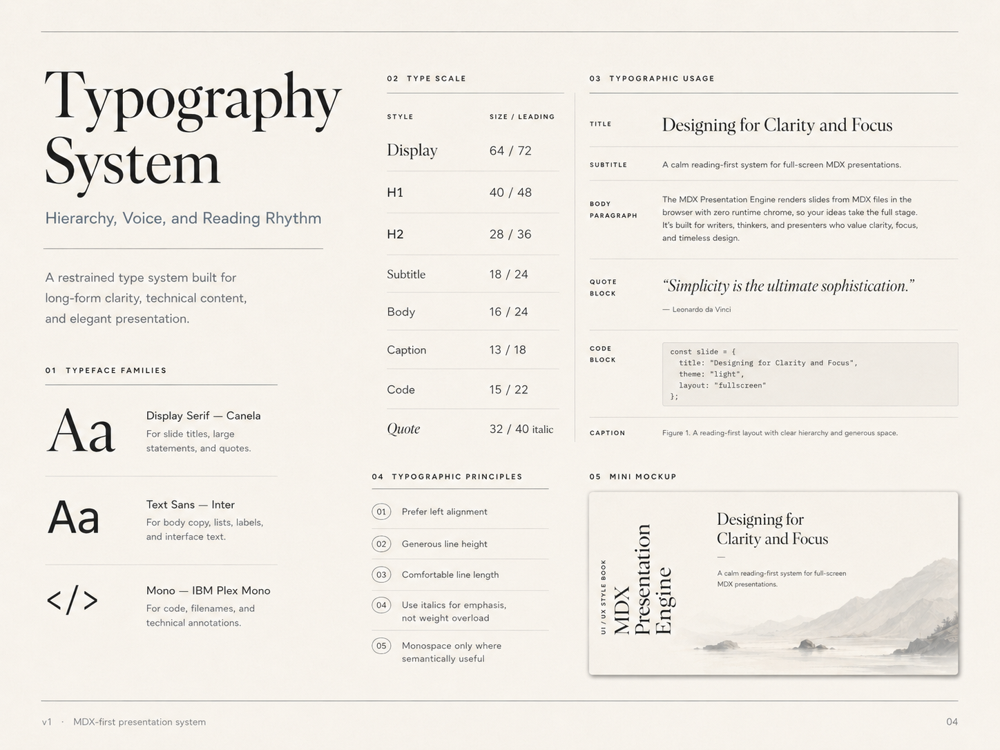

# 10 — CSS Design Tokens

## Visual references





This file contains implementation-ready CSS tokens for the MDX Presentation Engine visual system.

## Theme tokens

```css
:root,
[data-theme='light'] {
  color-scheme: light;

  --color-bg: #F7F4EF;
  --color-surface: #EAE4D8;
  --color-surface-soft: #F2EEE7;
  --color-text: #1F1E1B;
  --color-text-muted: #6E716F;
  --color-rule: #D7D0C5;
  --color-accent: #7E8A92;
  --color-shadow: rgb(31 30 27 / 0.14);
}

[data-theme='dark'] {
  color-scheme: dark;

  --color-bg: #171613;
  --color-surface: #24211D;
  --color-surface-soft: #1E1C18;
  --color-text: #E8E1D5;
  --color-text-muted: #8F8A82;
  --color-rule: #3A3732;
  --color-accent: #98A4A8;
  --color-shadow: rgb(0 0 0 / 0.35);
}
```

## Typography tokens

```css
:root {
  --font-display: 'Canela', 'Cormorant Garamond', 'Spectral', Georgia, serif;
  --font-sans: Inter, 'Source Sans 3', ui-sans-serif, system-ui, sans-serif;
  --font-mono: 'IBM Plex Mono', 'JetBrains Mono', ui-monospace, SFMono-Regular, Menlo, monospace;

  --type-display: clamp(3rem, 6vw, 4rem);
  --type-h1: clamp(2rem, 4vw, 2.5rem);
  --type-h2: clamp(1.5rem, 3vw, 1.75rem);
  --type-subtitle: clamp(1rem, 1.8vw, 1.125rem);
  --type-body: clamp(0.95rem, 1.4vw, 1rem);
  --type-caption: clamp(0.75rem, 1.1vw, 0.8125rem);
  --type-code: clamp(0.85rem, 1.2vw, 0.9375rem);
  --type-quote: clamp(1.75rem, 3.5vw, 2rem);
}
```

## Spacing tokens

```css
:root {
  --space-1: 0.5rem;   /* 8px */
  --space-2: 1rem;     /* 16px */
  --space-3: 1.5rem;   /* 24px */
  --space-4: 2.5rem;   /* 40px */
  --space-5: 4rem;     /* 64px */
  --space-6: 6rem;     /* 96px */

  --outer-margin: clamp(3rem, 6vw, 6rem);
  --title-rail-width: clamp(7.5rem, 10vw, 10rem);
  --content-max-width: 42.5rem;
  --content-wide-max-width: 47.5rem;
}
```

## Base reset

```css
html,
body,
#root {
  width: 100%;
  height: 100%;
  margin: 0;
  overflow: hidden;
}

body {
  background: var(--color-bg);
  color: var(--color-text);
  font-family: var(--font-sans);
  text-rendering: optimizeLegibility;
  -webkit-font-smoothing: antialiased;
}

* {
  box-sizing: border-box;
}
```

## Slide frame

```css
.slide {
  position: relative;
  width: 100vw;
  height: 100dvh;
  overflow: hidden;
  background:
    radial-gradient(circle at 20% 10%, rgb(255 255 255 / 0.08), transparent 32rem),
    var(--color-bg);
  color: var(--color-text);
}

.slide::before,
.slide::after {
  content: '';
  position: absolute;
  left: var(--outer-margin);
  right: var(--outer-margin);
  height: 1px;
  background: var(--color-rule);
  opacity: 0.75;
}

.slide::before {
  top: var(--space-4);
}

.slide::after {
  bottom: var(--space-4);
}
```

## Title rail

```css
.slide-title-rail {
  position: absolute;
  left: var(--outer-margin);
  bottom: calc(var(--outer-margin) + var(--space-2));
  width: var(--title-rail-width);
  max-height: 70dvh;
  display: flex;
  align-items: flex-end;
  gap: var(--space-2);
  writing-mode: vertical-rl;
  text-orientation: mixed;
  transform: rotate(180deg);
  z-index: 2;
}

.slide-title-rail__subtitle {
  font-family: var(--font-sans);
  font-size: 0.6875rem;
  line-height: 1;
  letter-spacing: 0.18em;
  text-transform: uppercase;
  color: var(--color-text-muted);
}

.slide-title-rail__title {
  margin: 0;
  font-family: var(--font-display);
  font-size: clamp(2rem, 4vw, 3.25rem);
  line-height: 0.95;
  letter-spacing: -0.02em;
  color: var(--color-text);
}
```

## Content zone

```css
.slide-content {
  position: absolute;
  inset:
    var(--outer-margin)
    var(--outer-margin)
    var(--outer-margin)
    calc(var(--outer-margin) + var(--title-rail-width) + var(--space-5));
  display: grid;
  align-content: center;
  justify-items: start;
  gap: var(--space-3);
}

.slide-content > * {
  max-width: var(--content-max-width);
}
```

## Typography defaults

```css
.slide-content h1 {
  margin: 0;
  font-family: var(--font-display);
  font-size: var(--type-h1);
  line-height: 1.15;
  letter-spacing: -0.025em;
}

.slide-content h2 {
  margin: 0;
  font-family: var(--font-display);
  font-size: var(--type-h2);
  line-height: 1.25;
}

.slide-content p {
  margin: 0;
  font-family: var(--font-sans);
  font-size: var(--type-body);
  line-height: 1.5;
  color: var(--color-text-muted);
}

.slide-content blockquote {
  margin: 0;
  font-family: var(--font-display);
  font-size: var(--type-quote);
  line-height: 1.25;
  font-style: italic;
  color: var(--color-text);
}

.slide-content code,
.slide-content pre {
  font-family: var(--font-mono);
  font-size: var(--type-code);
}
```
