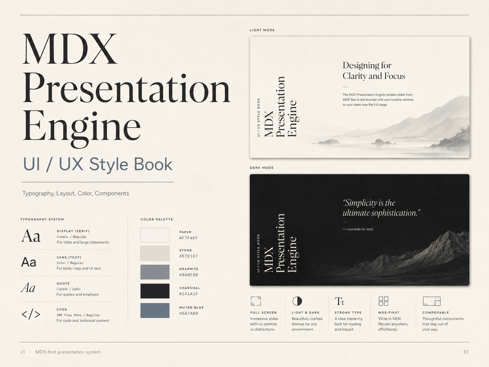

# MDX Presentation Engine — UI/UX Style Book

## Visual concept

## Concept pages

| Area | Reference |
|---|---|
| Core principles + slide anatomy |  |
| Color system |  |
| Typography system |  |
| Layout mechanics |  |
| Content components |  |
| Light-mode slide patterns |  |
| Dark-mode slide patterns |  |

This folder documents the visual language, interaction model, and authoring rules for the MDX Presentation Engine.

The engine is a markdown-first, React-enhanced presentation system that renders MDX slides from `lectures/<lecture-slug>/<NNN-topic-name>.mdx` in a full-screen browser viewport. Each slide has required `title` frontmatter and optional `subtitle`, with title/subtitle rendered consistently on every slide.

## Design direction

The product should feel like a quiet typographic book projected on screen:

- calm, minimal, editorial
- warm paper-like neutrals instead of harsh black/white
- strong typographic hierarchy
- no visible controls, chrome, progress bars, gutters, or toolbars
- vertical title/subtitle rail in the lower-left corner, reading bottom-to-top
- full-screen canvas: `100vw × 100dvh`
- content composed from readable MDX blocks

## Documents

1. [`01-principles.md`](./01-principles.md) — core design principles
2. [`02-slide-anatomy.md`](./02-slide-anatomy.md) — slide structure and spatial zones
3. [`03-color-system.md`](./03-color-system.md) — light/dark tokens and usage rules
4. [`04-typography-system.md`](./04-typography-system.md) — type families, scale, and usage
5. [`05-layout-mechanics.md`](./05-layout-mechanics.md) — grid, margins, rhythm, and patterns
6. [`06-content-components.md`](./06-content-components.md) — MDX block rules and component behavior
7. [`07-slide-patterns.md`](./07-slide-patterns.md) — recommended slide compositions
8. [`08-interaction-and-engine-rules.md`](./08-interaction-and-engine-rules.md) — runtime UX and engine constraints
9. [`09-mdx-authoring-guide.md`](./09-mdx-authoring-guide.md) — how authors should write slides
10. [`10-css-design-tokens.md`](./10-css-design-tokens.md) — implementation-ready CSS variables

## North star

A slide should make one idea obvious, with enough silence around it that the viewer can actually read.
